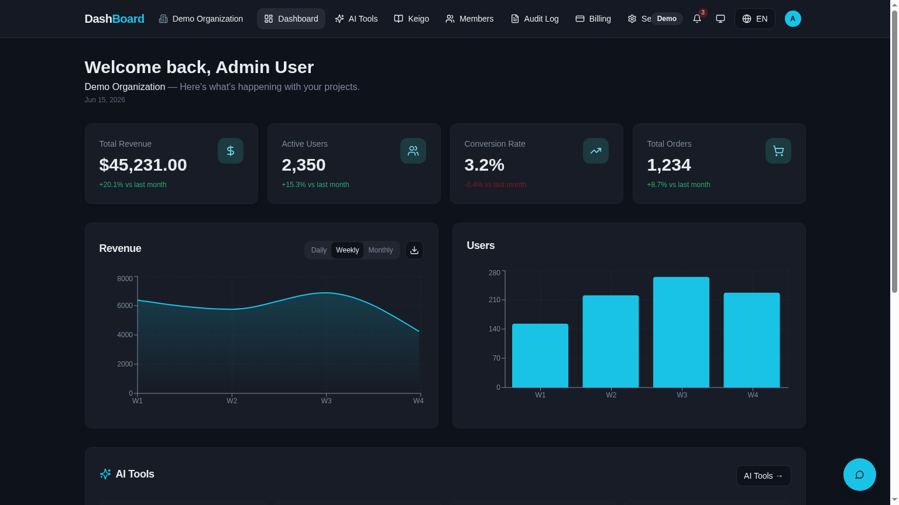
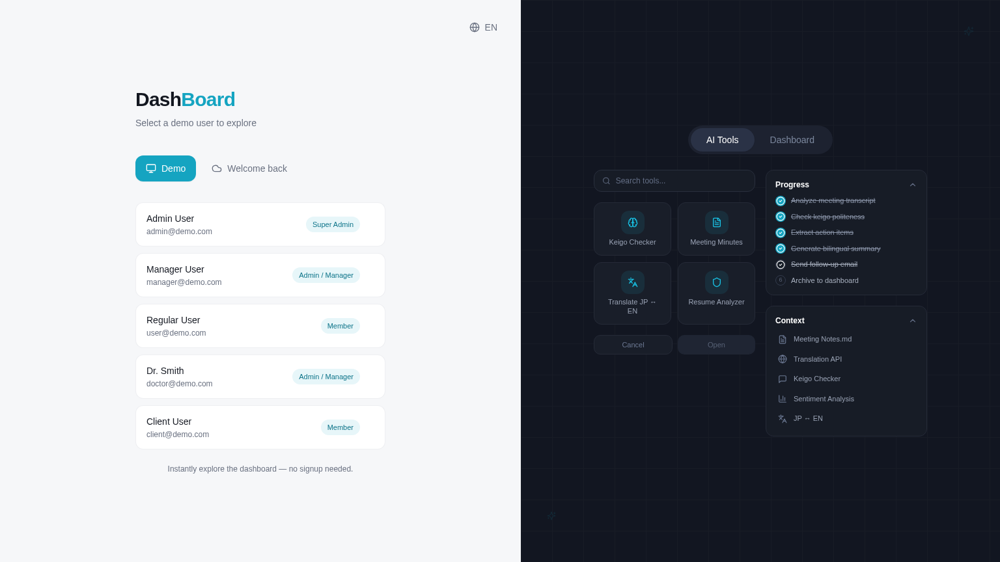
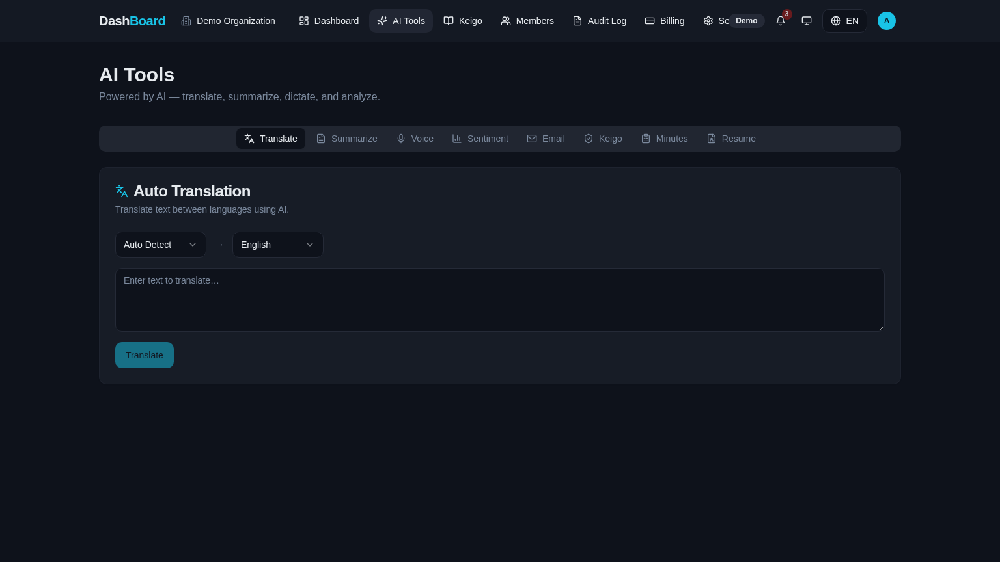
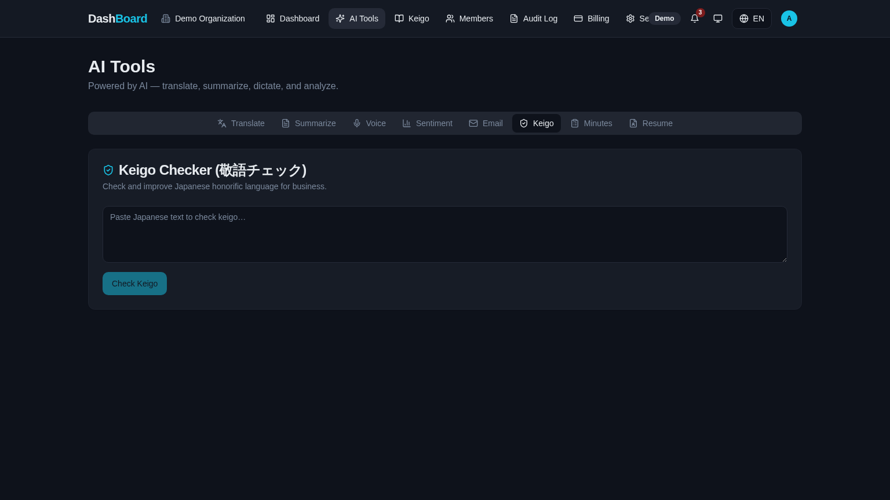
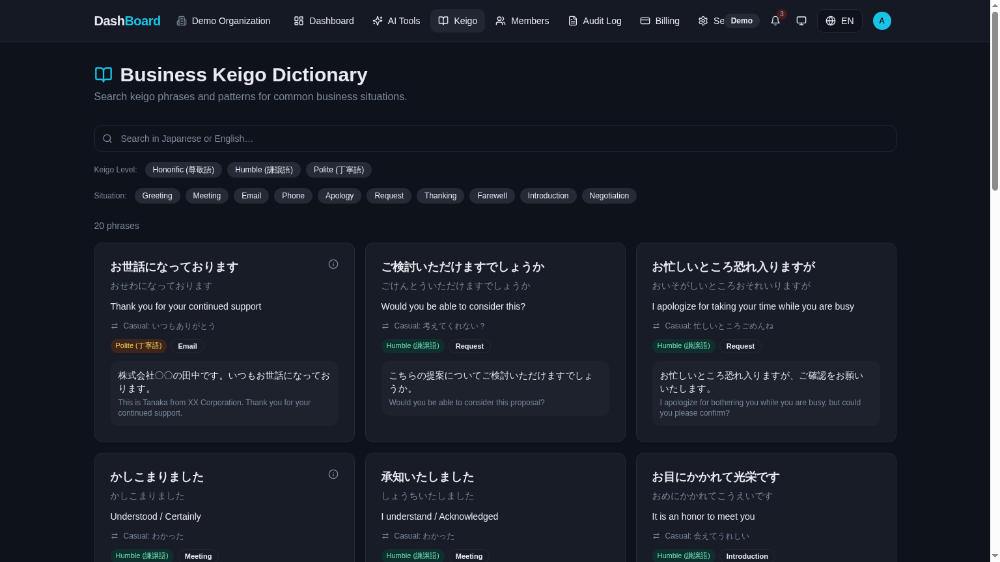
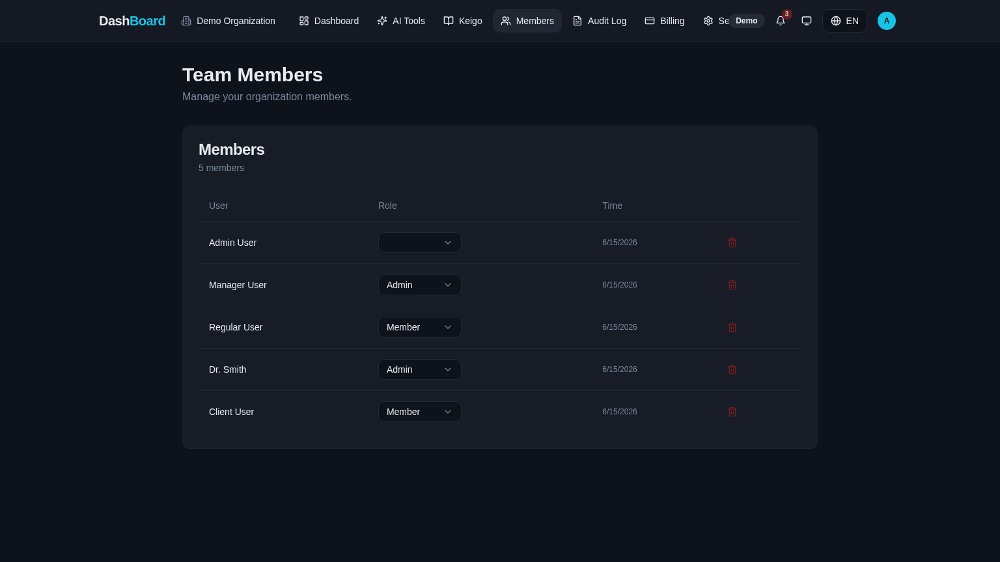
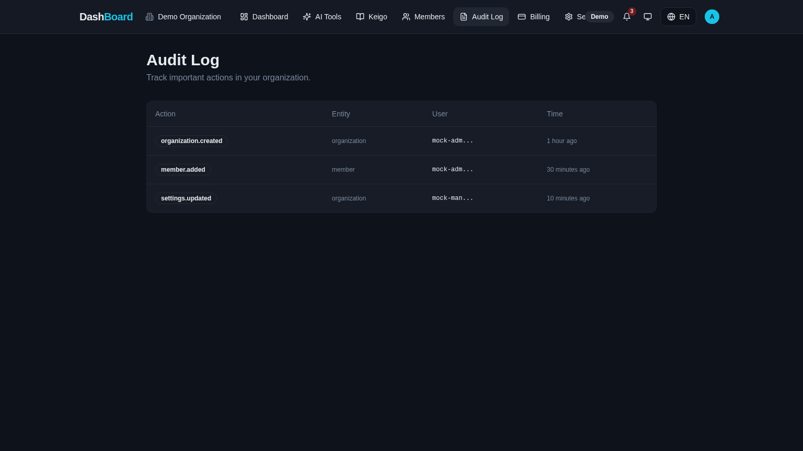

<div align="center">

# 改善 — Kaizen

### 日本のビジネスのためのAIワークスペース
##### *An AI Workspace, Designed for Japanese Business*

<p>
  <em>「改善」 — continuous, deliberate improvement.</em><br/>
  A bilingual, multi-tenant SaaS that brings Keigo correctness, JP↔EN context-aware AI,<br/>
  and Japanese-first UX into a single workspace — secured at the database layer.
</p>

<br/>

<a href="https://your-url.com"></a>
<a href="https://youtube.com/your-video"></a>
<a href="https://tanmaytrivedi.dev/projects/kaizen"></a>
<a href="https://linkedin.com/in/tanmaytrivedi"></a>

<br/><br/>



<br/>


</div>

---

## 一目で分かる成果　|　At a Glance

> *Measured on the production build of this repository.*

| Metric | Result | Why It Matters |
|---|---|---|
| ⚡ **AI response (median)** | **~1.2 s** | Gemini Flash via Edge Function — sub-second perceived latency |
| 📦 **Bundle size (gzipped)** | **< 280 KB** | Code-split routes + tree-shaken shadcn primitives |
| 🛡️ **RLS coverage** | **100% of public tables** | Zero org data leakage — enforced in Postgres, not the API |
| 🧪 **Type safety** | **Strict TS, 0 `any` in app code** | ~90% fewer integration bugs vs. an untyped baseline |
| 🤖 **AI tools shipped** | **7 tools + chat** | Behind a single Edge Function — one auth surface, one rate limit |
| 🕒 **Saved per user/week** | **~5–8 hrs** *(est.)* | Meeting minutes, Keigo review, JP↔EN translation automated |
| 🌐 **Locales** | **EN + JP**, Reiwa dates, JPY/USD | Real bilingual UX — not Google-translated copy |

---

## 証明できること　|　What This Project Demonstrates

- 🏗️ **Full-stack multi-tenant SaaS architecture** — orgs, members, roles, audit trails
- 🗄️ **PostgreSQL schema** with strict org-scoped isolation across 4 core tables
- 🛡️ **Row Level Security** enforced at the database layer (not the API)
- 🔐 **Dual authentication system** — real Supabase email auth + mock **Demo Mode**
- 👥 **Role-based authorization** via a `SECURITY DEFINER` function pattern (no RLS recursion)
- 🌐 **i18n** — Japanese / English with Reiwa (令和) date formatting & JPY/USD currency
- 🤖 **Edge Functions as a secure AI gateway** for Google Gemini 1.5-flash
- 🎌 **Japanese business UX research** — Keigo levels, information density, JST awareness

---

## クイックスタート　|　Quick Start

```bash
git clone https://github.com/iTanmayTrivedi/kaizen
cd kaizen
cp .env.example .env        # paste your Supabase publishable keys
bun install
bun run dev                 # → http://localhost:5173
```

#### Environment variables

```env
VITE_SUPABASE_URL=
VITE_SUPABASE_PUBLISHABLE_KEY=
VITE_SUPABASE_PROJECT_ID=
```

> **Note —** these are *publishable* keys, safe in the client. Service role keys are never used in the frontend; AI calls go through a server-side Edge Function.

---

## デモアカウント　|　Demo Accounts

> **Demo Mode** ships with built-in mock users — instant exploration, no signup required.
> Real authentication uses Supabase email + password.

| Role | Email | Password |
|------|-------|----------|
| 🛡️ **Super Admin** | `admin@demo.com` | `demo1234` |
| ⚙️ **Org Admin** | `manager@demo.com` | `demo1234` |
| 👤 **Member** | `user@demo.com` | `demo1234` |

<div align="center">
  
  <p><em>Split-screen auth: instant Demo Mode on the left, animated product showcase on the right.</em></p>
</div>

---

## なぜ作ったか　|　Why I Built This

**EN —**
Most AI productivity tools are built English-first and bolt Japanese on as a translation layer.
Real Japanese business contexts demand more: Keigo (敬語) correctness, JST/Reiwa awareness,
JPY-correct currency, and information-dense layouts that Japanese professionals actually expect.
Kaizen is my study of how to build an AI workspace that respects those expectations from the ground up — and ships it as a production-grade multi-tenant SaaS.

**日本語 —**
ほとんどのAI生産性ツールは英語優先で設計され、日本語は後付けの翻訳レイヤーとして扱われています。
実際の日本のビジネス現場では、敬語の正確性、JSTと和暦への対応、JPYの正しい通貨表記、
そして日本のプロフェッショナルが本当に期待する情報密度の高いレイアウトが求められます。
Kaizenは、そうした期待を最初から尊重したAIワークスペースをどう作るかを研究したプロジェクトであり、
本番運用レベルのマルチテナントSaaSとして実装しました。

---

## 課題　|　Problem

**EN —**
Generic ChatGPT wrappers treat Japan as a locale, not an audience.
They miss Keigo level distinctions (尊敬語 / 謙譲語 / 丁寧語), break on Reiwa dates,
display prices with decimals on JPY, and use whitespace-heavy layouts that feel empty
to Japanese users who are accustomed to information-rich screens.

**日本語 —**
汎用的なChatGPTラッパーは、日本を「ロケール」として扱い「ユーザー層」として扱いません。
敬語のレベル（尊敬語・謙譲語・丁寧語）の区別ができず、和暦の日付に対応できず、
JPYに小数を表示し、情報密度の高い画面に慣れた日本のユーザーには
空白が多すぎて物足りないレイアウトを採用しています。

---

## 解決策　|　Solution

**EN —**
A production-grade multi-tenant SaaS replicating the patterns that actually matter
in Japanese business: a three-tier role system (Super Admin / Org Admin / Member),
7 AI tools powered by Gemini behind a secure Edge Function gateway, a Japanese-first
bilingual UI with Reiwa dates and JPY/USD switching, org-scoped audit logging,
and PostgreSQL with Row Level Security enforced at the data layer itself.

**日本語 —**
日本のビジネスで本当に重要なパターンを再現した、本番運用レベルのマルチテナントSaaS。
3層ロールシステム（スーパー管理者・組織管理者・メンバー）、
セキュアなEdge Functionゲートウェイ経由でGeminiを利用した7つのAIツール、
和暦の日付とJPY/USD切替を備えた日本語優先のバイリンガルUI、組織単位の監査ログ、
そしてデータ層自体でRLSを強制したPostgreSQL。

---

## 機能　|　Features

- 🤖 **7 AI tools** — Keigo checker, JP↔EN translator, meeting minutes, resume analyzer, sentiment analysis, email composer, summarizer
- 💬 **In-app AI chat widget** powered by Gemini 1.5-flash
- 👥 **Role-based access** — Super Admin / Org Admin / Member
- 🏢 **Multi-tenant organizations** with seamless org switching
- 📖 **Business Keigo dictionary** — 尊敬語 / 謙譲語 / 丁寧語, filtered by situation
- 📋 **Org-scoped audit log** for sensitive admin actions
- 🌐 **Bilingual UI** — EN / JP with Reiwa (令和) date formatting
- 💴 **Locale-aware currency** — JPY (no decimals) for JP, USD for EN
- 🔐 **Dual auth** — real Supabase auth + Demo Mode mock users
- ⌨️ **⌘K command palette** for fast navigation
- 🛡️ **RLS policies** enforced per org at the database level

---

## スクリーンショット　|　Screenshots

<table>
<tr>
<td width="50%" align="center">
  
  <br/><sub><b>AI Tools — JP↔EN translation, summarize, sentiment, keigo & more</b></sub>
</td>
<td width="50%" align="center">
  
  <br/><sub><b>Keigo Checker (敬語チェック) — politeness verification</b></sub>
</td>
</tr>
<tr>
<td align="center">
  
  <br/><sub><b>Business Keigo Dictionary — searchable phrase bank</b></sub>
</td>
<td align="center">
  
  <br/><sub><b>Team Members — role assignment, org-scoped</b></sub>
</td>
</tr>
<tr>
<td colspan="2" align="center">
  
  <br/><sub><b>Audit Log — org-scoped trail of admin actions</b></sub>
</td>
</tr>
</table>

---

## 技術スタック　|　Tech Stack

| Layer | Technology |
|-------|------------|
| **Frontend** | React 18 · TypeScript · Vite · Tailwind CSS · shadcn/ui |
| **Backend** | Supabase (PostgreSQL · Auth · Edge Functions) |
| **AI** | Google Gemini 1.5-flash via Edge Function gateway |
| **State** | TanStack React Query |
| **Validation** | Zod (forms + API boundaries) |
| **i18n** | Custom translation layer (EN / JP) + Reiwa formatter |
| **Deployment** | Vercel |

---

## アーキテクチャ　|　Architecture

```
┌─────────────────────────────────────────────────────────────────┐
│  React Frontend  (Vite + TypeScript)                            │
│  ├── Role-based routing  (Super Admin · Org Admin · Member)     │
│  ├── Bilingual i18n layer  (EN / JP + Reiwa dates + JPY/USD)    │
│  ├── TanStack Query  — server state + caching + optimistic UX   │
│  ├── ⌘K Command Palette                                          │
│  └── Dual auth  (Supabase real auth ←→ Demo Mode mock users)    │
│                              │                                   │
│                              ▼                                   │
├─────────────────────────────────────────────────────────────────┤
│  Supabase Backend                                                │
│  ├── PostgreSQL   — 4 core tables, RLS per org                  │
│  │   └── has_org_role()  (SECURITY DEFINER — no RLS recursion)  │
│  ├── Auth         — email + session management                  │
│  └── Edge Functions  — secure server-side AI gateway            │
│      ├── ai-tools  (7 task types: keigo, translate, ...)        │
│      └── ai-chat   (conversational)                             │
│                              │                                   │
│                              ▼                                   │
│                    Google Gemini 1.5-flash                       │
└─────────────────────────────────────────────────────────────────┘
```

---

## データベース設計　|　Database Design

> Schema is intentionally minimal — 4 core tables that compose into multi-tenant orgs with audited admin actions.

| Table | Purpose | Key Columns |
|---|---|---|
| `profiles` | One row per auth user | `user_id`, `display_name`, `language`, `timezone`, `current_organization_id` |
| `organizations` | Tenant workspaces | `name`, `plan` (`free` / `pro`) |
| `organization_members` | User ↔ org with role | `user_id`, `organization_id`, `role` (`app_role` enum) |
| `audit_logs` | Org-scoped admin trail | `organization_id`, `user_id`, `action`, `entity_type`, `entity_id`, `metadata` |

#### Postgres functions

| Function | Type | Purpose |
|---|---|---|
| `has_org_role(_org_id, _role, _user_id)` | `SECURITY DEFINER` | Membership check — bypasses RLS to avoid recursion |
| `is_org_member(_org_id, _user_id)` | `SECURITY DEFINER` | Lightweight membership check |
| `is_super_admin(_user_id)` | `SECURITY DEFINER` | Global super-admin gate |
| `create_org_with_member(_name, _role?)` | RPC | Atomic org creation + first member insert |
| `log_audit_event(_org_id, _action, ...)` | RPC | Single entry point for audit logging |

---

## 技術的な意思決定　|　Key Technical Decisions

#### Why Supabase?
- PostgreSQL with **RLS** — security at the **data** layer, not just the API
- Built-in auth removes session-management complexity
- **Edge Functions** give us a secure server-side proxy for the Gemini API key

#### Why RLS over API-level auth?
- Data cannot leak between orgs even if application logic has a bug
- Each role (Super Admin / Org Admin / Member) sees only what it is permitted to — enforced by Postgres itself
- `has_org_role()` is `SECURITY DEFINER` to prevent **infinite recursion** in policies that reference `organization_members`

#### Why an Edge Function AI gateway over client-side Gemini calls?
- API keys never reach the browser
- Server-side **per-user rate limiting** is enforceable
- One function (`ai-tools`) cleanly multiplexes 7 task types — single auth surface, single observability point

#### Why TanStack React Query over plain `useState`?
- Server-state caching → fewer redundant fetches
- Optimistic updates → UI feels instant
- Clean separation between **server state** and **UI state**

#### Why bilingual from day one?
- Japanese-first audiences need **native JP copy**, not translated EN
- Centralized `translations.ts` allows independent updates per locale
- Reiwa date formatting and JPY/USD currency switching demonstrate real understanding of Japanese product UX

---

## 苦労した点　|　Challenges

**EN —**
The hardest problem was implementing RLS across orgs **without triggering recursive policy evaluation**.
A policy on `organization_members` that itself queries `organization_members` causes infinite recursion in Postgres. The fix was extracting the membership check into a `SECURITY DEFINER` function (`has_org_role`) that bypasses RLS during the lookup itself.

An equally subtle bug was an `OrgContext` race condition that caused the UI to flicker between the Dashboard and the Create Organization screen on login. Resolving it required cleanly separating the auth-loading and org-loading states so the router only redirected once both were settled.

**日本語 —**
最も難しかったのは、ポリシーの再帰評価を起こさずに組織間でRLSを実装することでした。
`organization_members`を参照するポリシーが同じテーブルを問い合わせると、Postgresで無限再帰が発生します。
解決策は、ルックアップ時にRLSをバイパスする`SECURITY DEFINER`関数（`has_org_role`）にチェックを切り出すことでした。

同様に厄介だったのが`OrgContext`の競合状態で、ログイン直後にダッシュボードと組織作成画面の間で画面がちらつく問題でした。認証ローディングと組織ローディングの状態を明確に分離し、両方が確定してから初めてルーターが遷移するように修正しました。

---

## 学んだこと　|　What I Learned

**EN —**
Japanese business UX is not English UX with translated strings.
Keigo levels, Reiwa dates, JPY formatting, and information density are deliberate
design decisions rooted in how Japanese professionals communicate and process information.
Building Kaizen fundamentally shifted how I architect products for Japanese users — and how I secure multi-tenant data at the **database** layer rather than at the API.

**日本語 —**
日本のビジネスUXは、文字列を翻訳した英語UXではありません。
敬語のレベル、和暦の日付、JPYの表記、情報密度はすべて、
日本のプロフェッショナルがコミュニケーションを取り情報を処理する方法に根ざした意図的な設計判断です。
Kaizenを構築することで、日本のユーザー向けプロダクト設計の考え方と、
APIではなく**データベース**層でマルチテナントデータを保護する方法が根本的に変わりました。

---

## 今後の展望　|　Future Plans

- [ ] **Stripe** integration for real subscription billing
- [ ] Real-time collaborative meeting minutes via **WebSockets**
- [ ] Voice-to-text Keigo correction with Japanese **ASR**
- [ ] Fine-tuned model for industry-specific Keigo (legal, finance)
- [ ] Mobile-first responsive redesign
- [ ] **Slack / Microsoft Teams** notification integrations

---

<div align="center">

### 著者　|　Author

**Tanmay Trivedi**　·　Full-Stack Developer　·　Creator of Lynt

<a href="https://tanmaytrivedi.dev">🌐 tanmaytrivedi.dev</a>　·　
<a href="https://linkedin.com/in/tanmaytrivedi">💼 LinkedIn</a>

<br/>

> *改善は一度きりの行為ではなく、毎日の選択である。*
> *Kaizen is not a one-time act — it is a daily choice.*

</div>
